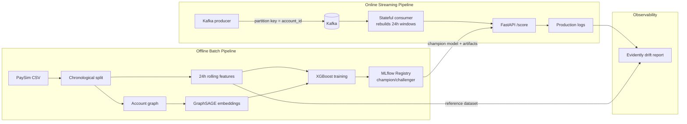

# Real-Time Fraud Detection & MLOps Pipeline

[](https://github.com/Shashwat-Kush/fraud-detection/actions/workflows/ci.yml)

An end-to-end, event-driven machine learning system that detects financial fraud in real time. It processes streaming transactions through Kafka, maintains stateful rolling-window features, augments tabular features with **GraphSAGE account embeddings**, serves predictions via an asynchronous FastAPI service, and continuously monitors for statistical data drift.

Built on the **PaySim** financial dataset (~6.3M transactions, <0.2% fraud rate) to simulate highly imbalanced, structurally accurate fraud typologies.

## 📊 Results

Evaluated on a strictly chronological hold-out set (final 20% of the historical window):

| Model | Threshold | Precision | Recall | F1 | AUC-PR |
|---|---|---|---|---|---|
| XGBoost baseline | 0.50 | 0.633 | 0.566 | 0.598 | 0.450 |
| XGBoost + `scale_pos_weight` | 0.50 | 0.285 | 0.991 | 0.443 | 0.905 |
| **XGBoost weighted, tuned threshold** (served champion) | 0.95 | 0.445 | 0.944 | **0.605** | **0.905** |
| GraphSAGE embeddings + XGBoost | 0.95 | 0.602 | 0.464 | 0.524 | 0.574 |

The **class-weighted XGBoost is the production champion**: it catches **94% of fraud** at an AUC-PR of **0.905**. AUC-PR is the metric that matters on a <0.2% positive rate — it summarizes the full precision/recall trade-off without being flattered by the 99.8% of easy negatives that inflate accuracy and ROC-AUC.

### A negative result: why the graph model didn't win

An earlier version of this project reported the graph model *beating* the tabular one (AUC-PR 0.878, precision 0.690). That result was **temporal leakage** — the account graph and its weak fraud labels were built from the *entire* history, so the GraphSAGE embeddings had effectively seen which accounts commit fraud in the test period. After rebuilding the graph from the **training window only** (`load_graph_window`), the graph model's AUC-PR fell from 0.878 to **0.574** — well below the plain tabular model. Three reasons it can't recover:

* **PaySim has no exploitable network structure.** Origin accounts almost never recur and destination accounts repeat only weakly, so the training-window graph shares few nodes with the test window. Most test transactions look up an account the graph never saw and receive an all-zero embedding.
* **The embeddings become cold-start noise, and it costs more than it helps.** XGBoost leans on the 128 embedding columns during training (where they carry weak-label signal), then meets mostly zeros at inference — a large train/test distribution shift that drags the graph model *below* the tabular baseline. Adding explicit `sender_in_graph`/`receiver_in_graph` indicators so the model could distinguish "unseen account" from "embedding near zero" left the metrics unchanged.
* **Graph learning pays off on datasets with real entity reuse** — shared devices/cards (IEEE-CIS) or transaction chains (the Elliptic Bitcoin graph) — which synthetic PaySim simply doesn't have.

The graph pipeline is kept end-to-end and registered as `fraud-detector-graph`, but the **API serves the tabular champion by default**. Shipping the simpler model on honest, leakage-free numbers is the point: the more interesting engineering result here is catching the leakage, not manufacturing a win.

## 🏗 System Architecture



1. **Offline Batch Pipeline (Training & Data Engineering)**
   * **Ingestion:** Parses raw PaySim CSVs, aligns schemas, and chronologically splits data into historical and streaming datasets to prevent future leakage.
   * **Feature Engineering:** Calculates 24-hour rolling aggregations (`txn_count_24h`, `amount_sum_24h`) partitioned by `account_id` using strict left-closed windows to prevent target-time leakage.
   * **Graph Learning:** Builds a directed account-interaction graph from the *training window only*, trains a 2-layer **GraphSAGE** network (PyTorch Geometric) with weak node labels, and extracts 64-dim account embeddings.
   * **Model Training:** Trains **XGBoost** on tabular + graph features with threshold sweeping to handle severe class imbalance (<0.2% fraud).
   * **Model Registry:** **MLflow** artifact tracking, signature enforcement, and automated Champion/Challenger promotion based on AUC-PR + recall gates.

2. **Online Streaming Pipeline (Inference & Serving)**
   * **Event Broker:** **Apache Kafka** (KRaft, single node) streams synthetic production data. Partition-key hashing on `account_id` guarantees per-account chronological ordering and prevents state corruption.
   * **Stream Processor:** A stateful Kafka consumer rebuilds dynamic account histories in memory, aligning online features exactly with offline training distributions.
   * **Inference API:** A **FastAPI** microservice that loads the champion model and its encoder/embedding artifacts from MLflow at startup, validates schema contracts via **Pydantic**, serves predictions, and logs scored payloads asynchronously.

3. **Observability Layer (Drift Monitoring)**
   * Compares production logs against the training reference dataset using **Evidently AI**.
   * Tracks leading indicators (data drift, prediction drift) instead of waiting for delayed ground-truth labels (chargebacks).

## 🛠 Technology Stack
* **Stream Processing:** Apache Kafka (KRaft), confluent-kafka
* **Machine Learning:** XGBoost, PyTorch Geometric (GraphSAGE), scikit-learn, pandas
* **Model Serving:** FastAPI, Uvicorn, Pydantic
* **MLOps & Tracking:** MLflow, Evidently AI
* **Infrastructure & Quality:** Docker Compose, pytest, ruff, GitHub Actions

## 🚀 Quickstart

### Prerequisites
* Python 3.11+, Docker
* Download the [PaySim dataset](https://www.kaggle.com/datasets/ealaxi/paysim1) and place the CSV at `data/raw/transactions.csv`
* `pip install -r requirements.txt`

### 1. Infrastructure (Kafka + MLflow)
```bash
make up          # docker compose up -d
```

### 2. Offline pipeline (tabular baseline)
```bash
make train       # ingest -> rolling features -> XGBoost -> MLflow registry
```

### 3. Graph pipeline (GraphSAGE + XGBoost)
```bash
make graph       # GraphSAGE training -> embeddings -> graph-augmented XGBoost
```

### 4. Online pipeline (streaming inference)
```bash
make serve       # FastAPI on :8000 (loads champion model from MLflow)
make produce     # terminal 2: stream transactions into Kafka
make consume     # terminal 3: stateful consumer scores the stream
```

### 5. Drift diagnostics
```bash
make monitor     # writes data/processed/drift_report.html
```

### Tests & lint
```bash
make test
make lint
```

## 🧠 Key Engineering Decisions
* **Strict chronological splits:** No random train/test splits anywhere — time-ordered slicing prevents future leakage in both the tabular and graph pipelines.
* **Leakage-safe graph construction:** The account graph and its weak fraud labels are built from the *training window only*. Building them from the full history would let GraphSAGE embeddings memorize test-period fraud labels.
* **Left-closed rolling windows:** `closed="left"` excludes the current transaction from its own 24h aggregates (verified by unit test).
* **Partitioned stream ordering:** Kafka partition keys on `account_id` guarantee per-account event ordering, eliminating race conditions in the consumer's rolling-window state.
* **Schema contract enforcement:** Pydantic schemas are synchronized with MLflow's inferred model signatures, so feature mismatches fail loudly at the API boundary instead of silently dropping columns.
* **Champion/Challenger promotion:** A candidate is promoted only if AUC-PR improves by >0.01 *and* recall does not regress — chosen for a domain where missed fraud is costlier than a re-review.
* **Leading vs. lagging indicators:** The monitoring layer tracks drift rather than waiting for delayed chargeback labels, enabling early alerting.

## 📁 Project Layout
```
src/
  ingest_paysim.py      # raw CSV -> chronological historical/streaming split
  features.py           # 24h left-closed rolling window features
  data_prep.py          # shared encoding/split logic (tabular + graph)
  model.py              # tabular XGBoost + MLflow champion/challenger
  graph_builder.py      # account graph, node features, weak labels (train window only)
  graph_model.py        # 2-layer GraphSAGE (PyG)
  train_graph.py        # GraphSAGE training (NeighborLoader, MPS/CPU)
  extract_embeddings.py # full-graph inference -> graph_embeddings.npy
  prepare_graph_data.py # joins embeddings onto tabular features
  train_graph_xgb.py    # graph-augmented XGBoost -> registry + promotion
  producer.py           # Kafka producer (partition key = account_id)
  consumer.py           # stateful consumer -> /score
  monitor.py            # Evidently drift report
  schemas.py            # Pydantic contracts (Kafka + API)
serve.py                # FastAPI inference service
tests/                  # leakage, schema, and serving unit tests
```
